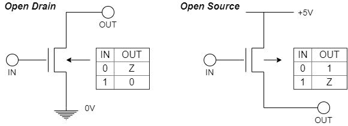
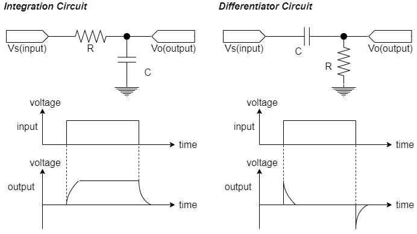
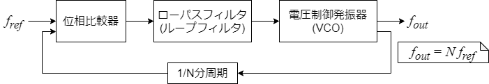

# Hardware

## 論理回路

### 組み合わせ論理回路

#### ド・モルガンの法則

$$
\overline{A・Ｂ} = \bar{A} + \bar{B} \\
\overline{A+Ｂ} = \bar{A} ・ \bar{B}
$$

#### スリーステートバッファ

入力と出力のほかに出力の可否を制御する信号を持つゲート

|IN|ENB|OUT|
|--|--|--|
|0|0|Z|
|0|1|0|
|1|0|Z|
|1|1|1|

※Zは、ハイインピーダンスを表す。(信号の衝突を避けるために用いる)

#### オープンドレインとオープンソース

インバータを構成する2個のトランジスタのうち、1個のみを利用する。

### 順序論理回路

#### ラッチ
1ビットの情報を保持できる状態を有する電子回路のこと。

<b>【TBW】RSラッチ</b>

<b>【TBW】Dラッチ</b>

#### フリップフロップ
1ビットの情報を一時的に"0"または"1"の状態として保持することができる論理回路のこと。

<b>【TBW】Dフリップフロップ</b>

<b>【TBW】JKフリップフロップ</b>

### 加算器

### カウンタ

### タイマ

#### ウォッチドックタイマ
システムの誤操作によってプログラムが正常に実行できなくなったことを検出し、システムをリセットするために用いるタイマ。指定時間が経過してタイムアウトが発生するとシステムをリセットするようなハードウェアタイマを設定しておく。

## アナログ回路

### AD変換

### DA変換

### 積分回路・微分回路

### 演算増幅器

### PWN：Pulse Width Modulation：パルス幅変調

### PLL：Phase Locked Loop：位相ロックループ
入力された周波数を逓倍する回路である。

## LSI

## メモリ

***
[TopPage](./README.md)