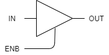

# 01.Hardware

## 論理回路

### 組み合わせ論理回路

#### ド・モルガンの法則

$$
\overline{A・Ｂ} = \bar{A} + \bar{B} \\
\overline{A+Ｂ} = \bar{A} ・ \bar{B}
$$

#### スリーステートバッファ

入力と出力のほかに出力の可否を制御する信号を持つゲート

|IN|ENB|OUT|
|--|--|--|
|0|0|Z|
|0|1|0|
|1|0|Z|
|1|1|1|

※Zは、ハイインピーダンスを表す。(信号の衝突を避けるために用いる)

